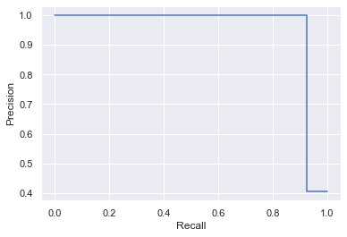

# Advanced Regression(Regularization) on Surprise House Dataset

> This project uses Logistic Regression to classify tumors into malignant (cancerous) or benign(non cancerous) on unbalanced class dataset. The model also uses regulization and hyperparametr tuning to get best possible result.

## Table of Contents

- [Advanced Regression(Regularization) on Surprise House Dataset](#advanced-regressionregularization-on-surprise-house-dataset)
  - [Table of Contents](#table-of-contents)
  - [General Information](#general-information)
    - [Problem Description](#problem-description)
    - [Objective](#objective)
    - [Steps involved](#steps-involved)
  - [Result](#result)
  - [Conclusion](#conclusion)
  - [Technologies Used](#technologies-used)
  - [Dataset Information](#dataset-information)
  - [Contact](#contact)
  - [License](#license)

<!-- You can include any other section that is pertinent to your problem -->

## General Information

### Problem Description

Breast cancer is the most common cancer amongst women in the world. It accounts for 25% of all cancer cases, and affected over 2.1 Million people in 2015 alone. It starts when cells in the breast begin to grow out of control. These cells usually form tumors that can be seen via X-ray or felt as lumps in the breast area.

### Objective

- Understand the Dataset & cleanup (if required).
- Build classification models to predict whether the cancer type is Malignant or Benign.
- Also fine-tune the hyperparameters

### Steps involved

- Data Load and Analysis
- Data Wragling
- Exploratory Data Analysis
- Splitting the dataset
- Scaling of the variables
- Modelling
- Tuning with Regularization
- Model Evaluation

## Result

We achieved the following results:

- Accuracy Score 0.9702380952380952
- Precision Score 1.0
- Recall Score 0.9264705882352942
- F1 Score 0.9618320610687023

## Conclusion

As it can be observed from the scenerio our concern is with precision with a good recall value, We have achieved 100 % with 92% recall on **test dataset** which is a great result and can be used to classify cancer tumors cells.

## Technologies Used

- Pandas - version 1.3.4
- NumPy - version 1.20.3
- MatplotLib - version 3.4.3
- Seaborn - version 0.11.2
- Scikit-Learn - version 0.24.2

<!-- As the libraries versions keep on changing, it is recommended to mention the version of library used in this project -->

## Dataset Information

This Dataset has been taken from Kaggle and is availabe on below
URL: https://www.kaggle.com/datasets/yasserh/breast-cancer-dataset

Thanks to M Yasser H for sharing the dataset with the world.

## Contact

Created by [@sukhijapiyush] - feel free to contact me!

<!-- Optional -->

## License

This project is open source and available without restrictions.

<!-- You don't have to include all sections - just the one's relevant to your project -->
